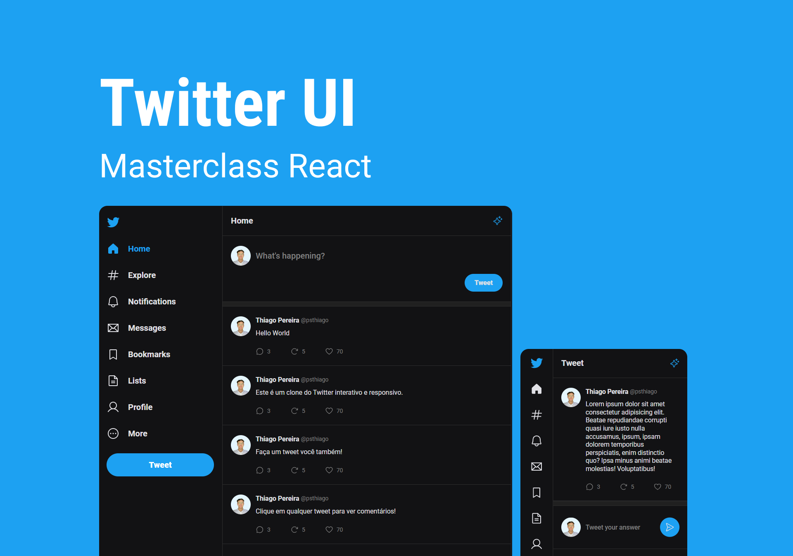

<h1 align="center"> Twitter UI </h1>

<!-- 

  

 -->

  <a href="#-projeto">Projeto</a>&nbsp;&nbsp;&nbsp;|&nbsp;&nbsp;&nbsp;
  <a href="#-layout">Layout</a>&nbsp;&nbsp;&nbsp;|&nbsp;&nbsp;&nbsp;
  <a href="#memo-licença">Licença</a>

  

## 🚀 Tecnologias

Esse projeto foi desenvolvido com as seguintes tecnologias:

- TypeScript
- React
- HTML e CSS
- Git e Github
- Figma

## 💻 Projeto

No projeto foi desenvolvido um clone da UI do Twitter sendo responsivo e interativo.

- [Visite o projeto online](https://txiago90.github.io/Twitter-UI/)

## 🔖 Layout

Você pode visualizar o layout do projeto através [DESSE LINK](https://www.figma.com/file/9DogJZN89AHAi0SyXaBr3T/Twitter-UI-(Community)?t=6zyB9QPauhc5OaXy-0). É necessário ter conta no [Figma](https://figma.com) para acessá-lo.

## :memo: Licença

Esse projeto está sob a licença MIT.

---

Feito com ♥ por Thiago
